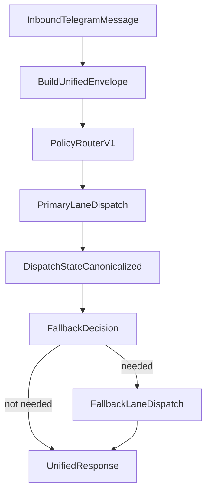

# Unified Architecture Spec

## Objective

Converge Eve and Hermes into one operating system with one control plane and one policy router while preserving current Eve production stability during migration.

## Canonical Contracts

- `UnifiedMessageEnvelope` (ingress)
- `RoutingDecision` (policy output)
- `DispatchState` (lane execution output)
- `UnifiedResponse` (reply payload)

Source definitions:
- `src/contracts/types.ts`
- `src/contracts/validate.ts`

## Sequence Flow

## Failure Taxonomy

- `provider_limit`
- `cooldown`
- `dispatch_failure`
- `state_unavailable`
- `policy_failure`

## Trace Model

Every message receives:
- `traceId`
- `chatId`
- `messageId`
- `policyVersion`
- `primaryLane`
- `fallbackLane`

## Lane Adapters

- `EveAdapter` uses the configured Eve dispatch script contract and maps to canonical `DispatchState`.
- `HermesAdapter` runs a configurable Hermes launch command and maps result to canonical `DispatchState`.

## Security and Rollback

- Fail-closed policy available via `UNIFIED_ROUTER_FAIL_CLOSED=1`.
- Routing can revert to Eve-only by setting:
  - `UNIFIED_ROUTER_DEFAULT_PRIMARY=eve`
  - `UNIFIED_ROUTER_DEFAULT_FALLBACK=none`
